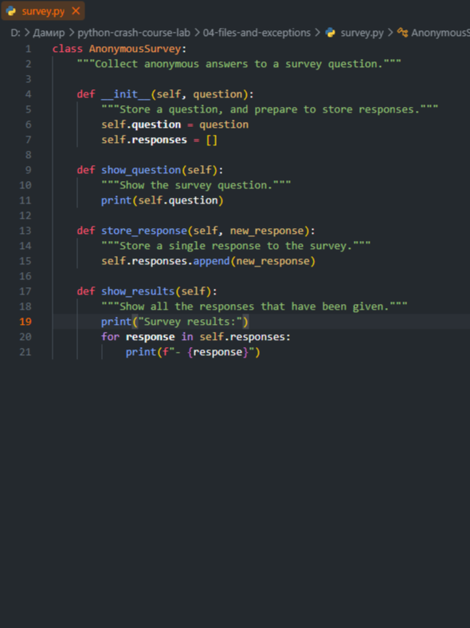
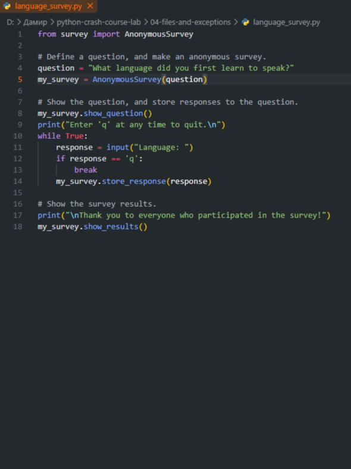
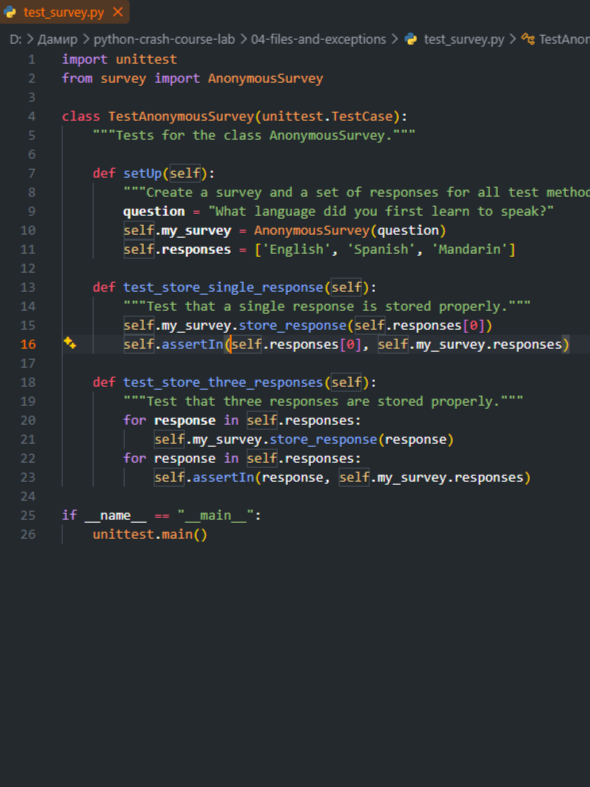

# python-crash-course-lab

Code solutions, exercises, and practice scripts from Eric Matthes' "Python Crash Course" (3rd Edition) 📖

---

## 🌐 Language Select / 选择语言 / Выбор языка
* 🇬🇧 [English Edition](#-english-version)
* 🇨🇳 [中文版 (Chinese Edition)](#-中文版)
* 🇷🇺 [Русская версия (Russian Edition)](#-русская-версия)

---

## 🇬🇧 English Version

### 📂 Program Execution Examples (Screenshots)
Below are examples of code and task execution from the four main sections of the repository:

#### 🔹 01-basics

  
  
  

#### 🔹 02-logic-and-loops

  
  
  

#### 🔹 03-functions-and-classes

  
  
  

#### 🔹 04-files-and-exceptions

  
  
  

### 🛠 Development Tools
* **Python** — The primary programming language used to write all scripts, logic, exception handling, and data structure management.

### ✍️ Authorship and Materials
All solutions, exercises, and lab works in this repository are based on the training materials of the world-famous bestselling book **"Python Crash Course" (3rd Edition)** by **Eric Matthes**. The book is recognized as one of the best practical guides for a deep dive into Python programming.

---

## 🇨🇳 中文版

### 📂 程序运行示例（截图）
以下是本仓库四个主要板块的代码与任务运行示例：

#### 🔹 01-basics（基础知识）

  
  
  

#### 🔹 02-logic-and-loops（逻辑与循环）

  
  
  

#### 🔹 03-functions-and-classes（函数与类）

  
  
  

#### 🔹 04-files-and-exceptions（文件与异常处理）

  
  
  

### 🛠 开发工具
* **Python** — 用于编写所有脚本、核心逻辑、异常处理和操作数据结构的核心编程语言。

### ✍️ 版权与教材说明
本仓库中的所有代码实现、练习和实验均基于全球畅销经典教材 **《Python编程：从入门到实践》（第3版）**，作者为 **埃里克·马瑟斯 (Eric Matthes)**。该书被公认为深入学习 Python 编程的最佳深度实践指南之一。

---

## 🇷🇺 Русская версия

### 📂 Примеры работы программ (Скриншоты)
Ниже представлены примеры выполнения заданий и работы кода из четырех основных разделов репозитория:

#### 🔹 01-basics

  
  
  

#### 🔹 02-logic-and-loops

  
  
  

#### 🔹 03-functions-and-classes

  
  
  

#### 🔹 04-files-and-exceptions

  
  
  

### 🛠 Инструменты разработки
* **Python** — основной язык программирования, используемый для написания всех скриптов, логики, обработки исключений и работы со структурами данных.

### ✍️ Авторство и материалы
Все решения, упражнения и лабораторные работы в этом репозитории написаны на основе учебных материалов всемирно известной книги-бестселлера **"Python Crash Course" (3rd Edition)**, автором которой является **Эрик Мэтиз (Eric Matthes)**. Книга признана одним из лучших практических руководств для глубокого погружения в программирование на Python.
