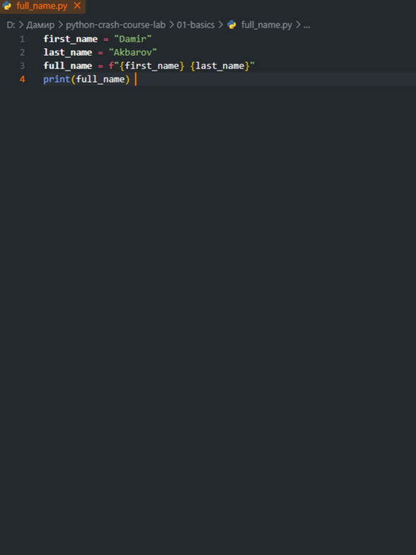
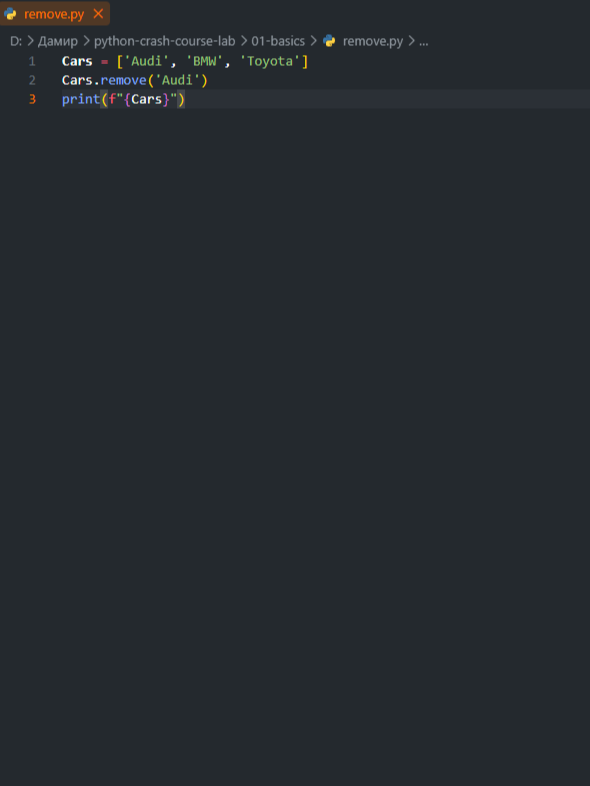
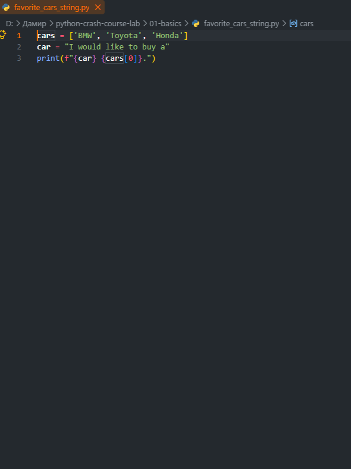
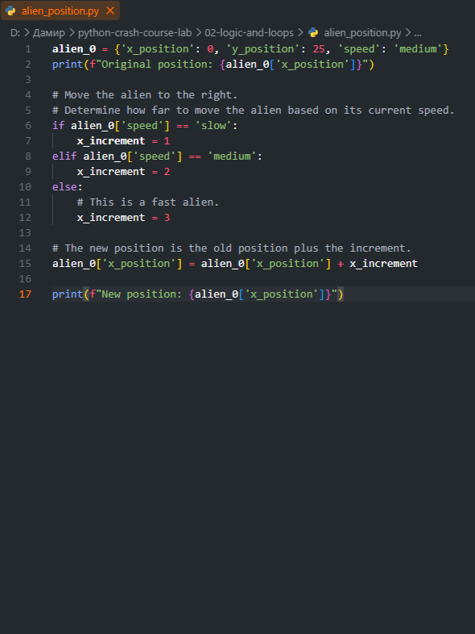
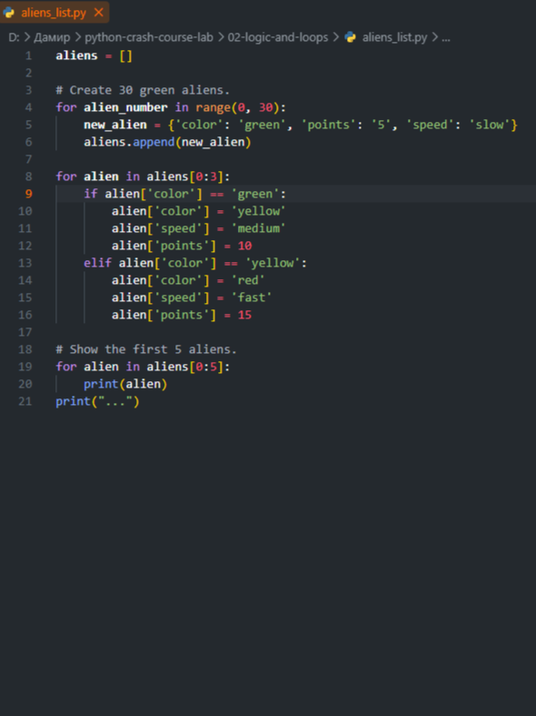
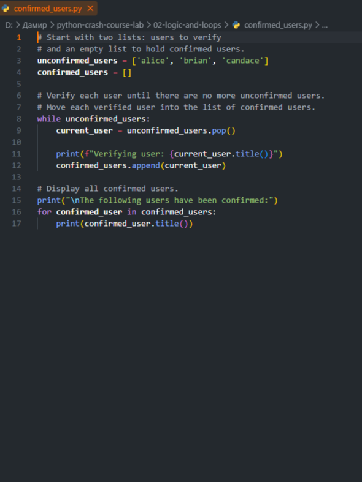
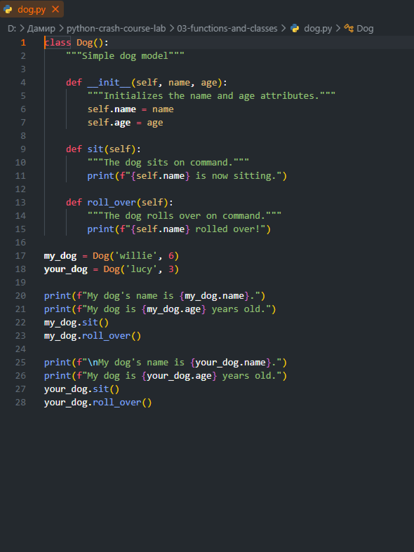
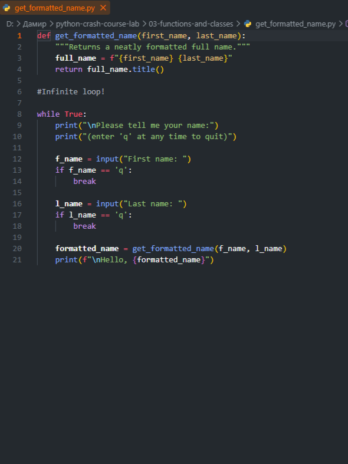
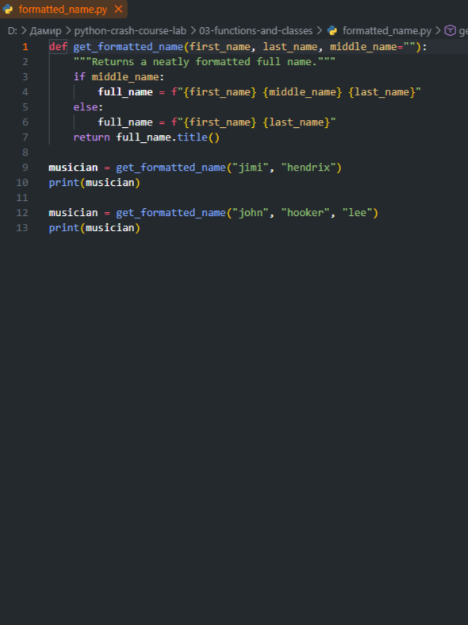

# python-crash-course-lab

Code solutions, exercises, and practice scripts from Eric Matthes' "Python Crash Course" (3rd Edition) 📖

## 📂 Примеры работы программ (Скриншоты)

Ниже представлены примеры выполнения заданий и работы кода из четырех основных разделов репозитория:

### 🔹 01-basics

  
  
  

### 🔹 02-logic-and-loops

  
  
  

### 🔹 03-functions-and-classes

  
  
  

### 🔹 04-files-and-exceptions

  
  
  

## 🛠 Инструменты разработки

*   **Python 3.x** — основной язык программирования, используемый для написания всех скриптов, логики, обработки исключений и работы со структурами данных.

## ✍️ Авторство и материалы

Все решения, упражнения и лабораторные работы в этом репозитории написаны на основе учебных материалов всемирно известной книги-бестселлера **"Python Crash Course" (3rd Edition)**, автором которой является **Эрик Мэтиз (Eric Matthes)**. Книга признана одним из лучших практических руководств для глубокого погружения в программирование на Python.
